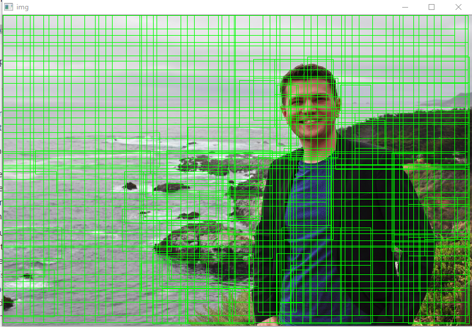
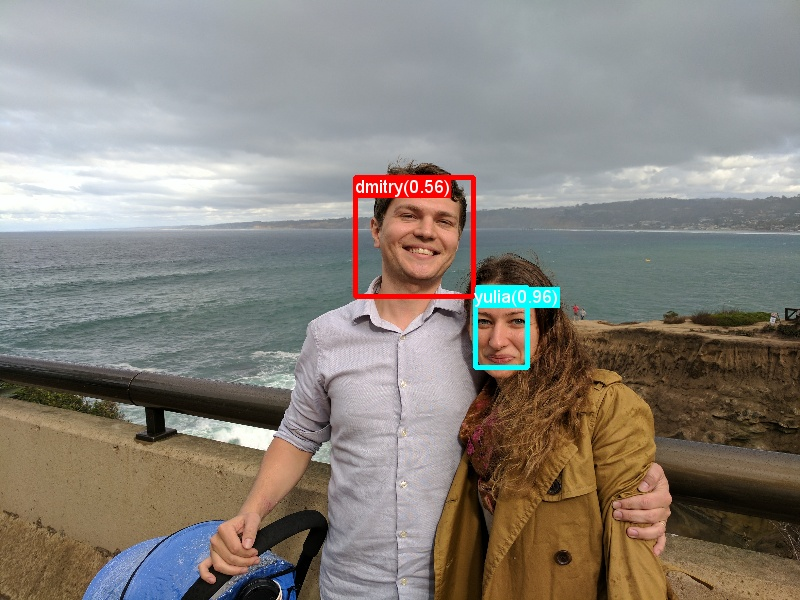
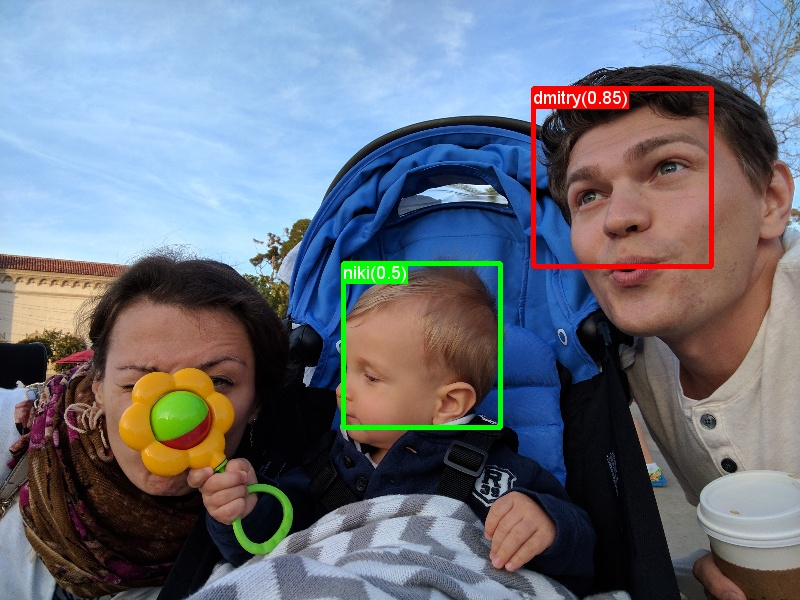
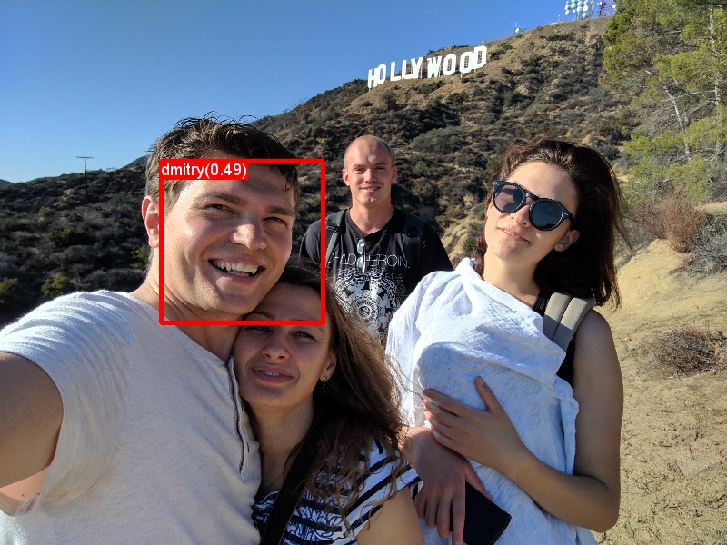
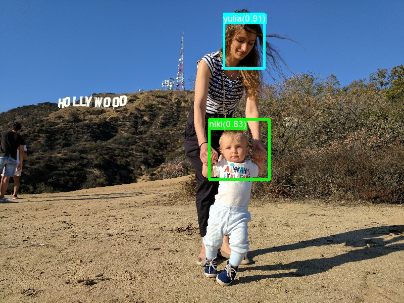
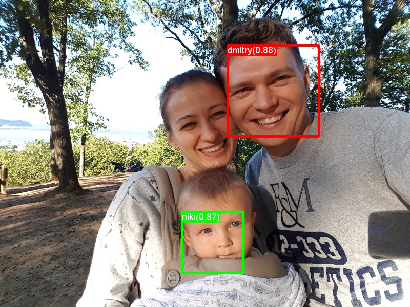
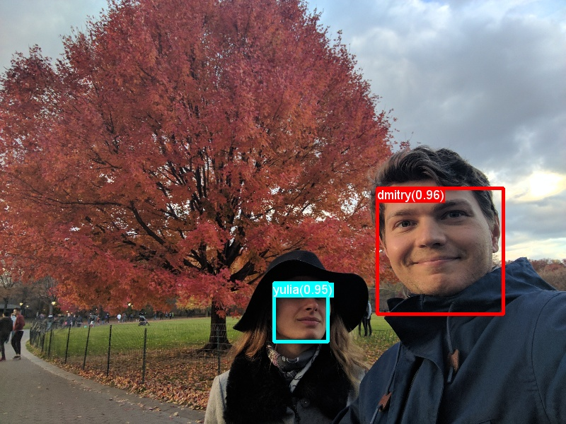

Deep Neural Networks for family photos
==============

Description
--------------

A results of using a trained visual classifier for face detection in family photos using Deep Neural Networks to automatically find features in tagged photos. Based on [Microsoft Cognitive Toolkit (CNTK)](https://github.com/Microsoft/CNTK) fast R-CNN implementation.

Testing a model with many people (Niki, Yulia and myself):

|Dataset|     AP(niki)|AP(dmitry)|AP(yulia)| mAP
|---|---|---|---|---|---|---
|Initial set|0.2500      |0.5741      |0.1481         |**0.324**
|Twice images|0.4167      |0.8333      |0.1785         |**0.476**

Adding twice more positive signals increases the mean average precision from 0.32-> 0.42, and adding more negative signals increased the mAP to 0.47.

In the test 18 faces, we have 6 non-detected misses, 1 erroneous recognition, 11 good.

TECHNICAL
----------

### STEP 1: Computing Region of Interests
`Script: 1_computeRois.py`

Region-of-interests (ROIs) are computed for each image independently using a 3-step approach: First, Selective Search is used to generate hundreds of ROIs per Image. These ROIs often fit tightly around some objects but miss other objects in the image. Many of the ROIs are bigger, smaller, etc. than the typical item in our dataset. Hence in a second step these ROIs are discarded. Finally, to complement the detected ROIs from Selective Search, ROIs that uniform cover the image are added at different scales and aspect ratios.

### STEP 2: Computing CNTK inputs
`Script: 2_cntkGenerateInputs.py`

Each ROI generated in the last step has to run through the CNTK model to compute its 4,096 float Deep Neural Network representation.
For debugging, the script `B2_cntkVisualizeInputs.py` can be used to visualize the content of these files.

### STEP 3: Running CNTK
`Script: 3_runCntk.py`

We can now run the CNTK executable which takes as input the coordinates and labels files from the last step and outputs the 4096 float embedding for each ROI and for each image, running on GPU.

### STEP 4: Classifier training
`Script: 4_trainSvm.py`

We now train the classifier which given an ROI as input, assigns it to one of the grocery items or to a “background” class.

### STEP 5: Evaluation and visualization
`Scripts: 5_evaluateResults.py and 5_visualizeResults.py`

Once training succeeded, the model can be used to find objects in images. For this, every ROI in an image is classified and assigned a confidence to be a label, ... and background. 

The accuracy of the classifier can be measured using the script `5_evaluateResults.py`. This outputs the mean Average Precision (mAP; see the [Mean Average Precision](#mean-average-precision) section) for either the training or the test set.

The output of the classifier can be visualized using the script `5_visualizeResults.py`.

### Mean Average Precision
Once trained, the quality of the model can be measured using different criteria, such as precision, recall, accuracy, area-under-curve, etc. A common metric which is used for the Pascal VOC object recognition challenge is to measure the Average Precision (AP) for each class. Average Precision takes confidence in the detections into account and hence assigns a smaller penalty to false detections with low confidence. For a description of Average Precision see [Everingham et. al](http://homepages.inf.ed.ac.uk/ckiw/postscript/ijcv_voc09.pdf). The mean Average Precision (mAP) is computed by taking the average over all APs.

CREDIT
----------

Base builds - Microsoft CNTK toolkit authors;

Augmented scripts, test data - (c) 2015+ Dmitry Sadakov 